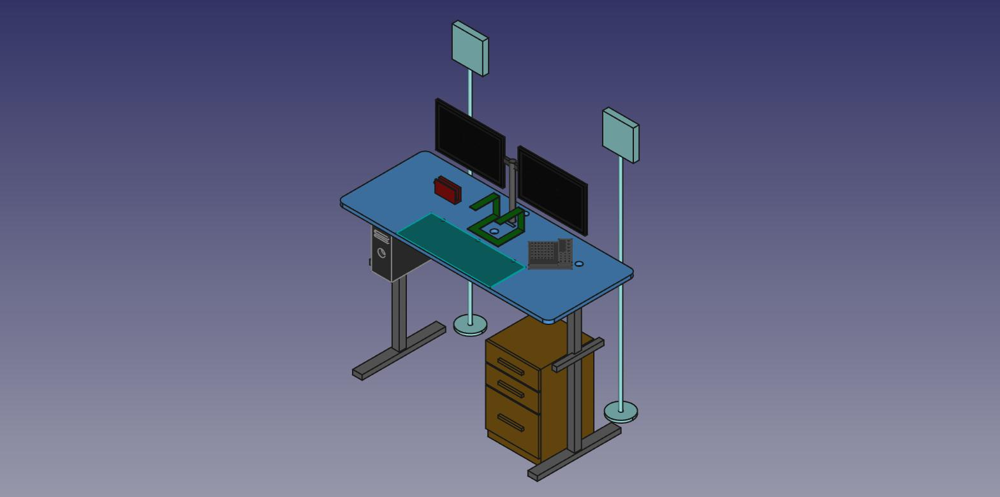

# MesaInteligente
Mesa Inteligente del Estudio de ALSW

# Funciones por hacer

* Monotoreo de Temperatura
* Chatbot
* Macros en pc
* Manejo de Luces
* Alarma
* Control de Tela verde 
* Manejo de PC

## Modelo 3D

Agujeros

## Dimenciones Mesa

largo | ancho | grosor
------------ | ------------- | -----------
180 cm  | 75 cm | 3 cm
